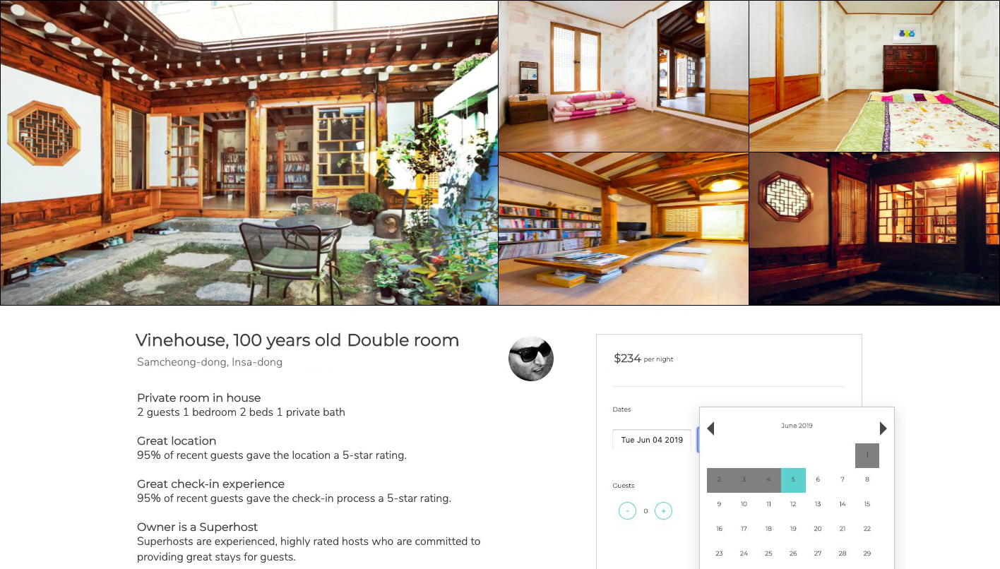

<!-- Main -->

<!-- One -->
<section id="one">
	

		<header class="major">
			<h2>See what I've built</h2>
		</header>
		

	

</section>

<!-- Two -->
<section id="two" class="spotlights">
	<section>
		
		

			

				<header class="major">
					<h3>Barebnb</h3>
					<h4>React, CSS-Styled Components, Express, AWS (S3) MongoDB, Mongoose, Jest</h4>
				</header>
				
Front-end application similar to that of Airbnb's. Created a component that displays reviews from a Mongo database and searches user reviews utilizing CSS-Styled Components, Express, Mongoose and Jest for testing.

				
<a href="https://github.com/5uper5quad/Ja5mine-5ervice" class="icon alt fa-github" target="_blank">GitHub</a>
				

			

		

	</section>
	<section>
		
		

			

				<header class="major">
					<h3>Exhaust</h3>
					<h4>React, Express, Node.js, AWS (EC2), PostgreSQL, Cassandra, New Relic</h4>
				</header>
				
Responsive front-end component similar to that of an online digital game purchasing platform. Refactored the backend and seeded the database with 10 million entries and then optimized it for performance utilizing New Relic to measure load. Deployed with AWS S3.

				
<a href="https://github.com/5dc-5uper5quad/5DC-Ja5mine-5ervice" class="icon alt fa-github" target="_blank">GitHub</a>
				

			

		

	</section>
	<section>
		
		

			

				<header class="major">
					<h3>Taco Locator</h3>
					<h4>React, CSS-Styled Components, Express, MongoDB, Mongoose, Jest</h4>
				</header>
				
Interactive front-end app that allows users to search for and save their favorite taco restaurants. Utilizes React, CSS, Express, MongoDB, and Mongoose.

				
<a href="https://github.com/jasminelopez/hrr38-mvp-project" class="icon alt fa-github" target="_blank">GitHub</a>
				

			

		

	</section>
</section>

<!-- Three -->
<section id="three">
	

		<header class="major">
			<h2>Get In Touch</h2>
		</header>
		

	

</section>

